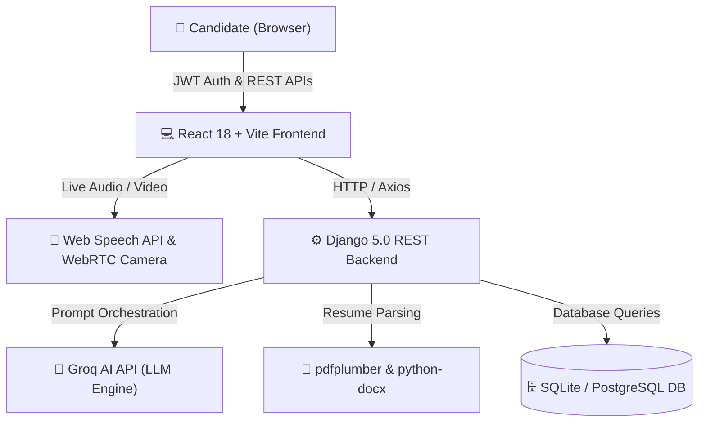

# Skillzo AI — Full Technical Working Roadmap & Architecture 🚀

Skillzo AI is a full-stack, real-time **AI-Powered Mock Interview & Career Readiness Studio** built with a **Django REST Framework** backend and a **React 18 + Vite** frontend.

---

## 🏗️ System Architecture & Data Flow

---

## 🔄 End-to-End Working Modules

### 1. 🔐 Module 1: Authentication & Account Security (`accounts/`)
- **JWT Token Flow**: Access & Refresh tokens via `djangorestframework-simplejwt`.
- **OTP Recovery**: Password reset verification via OTP debug / SMTP mailer.
- **Candidate Profiles**: Streak counter (`current_streak`), target roles, phone, and college/company metadata.

---

### 2. 🎯 Module 2: AI Mock Interview Engine (`interview/`)
1. **Setup Briefing (`InterviewSetup.jsx`)**: Candidate selects Target Role, Difficulty (Beginner, Intermediate, Advanced), and Format (Text, Audio, Video).
2. **Dynamic Question Generation**:
   - Backend sends role & difficulty prompt to **Groq AI**.
   - Receives structured JSON containing 5 tailored interview questions.
3. **Live Interactive Session (`InterviewSession.jsx`)**:
   - **TTS Read-Aloud**: Question is automatically spoken using browser `SpeechSynthesis`.
   - **Speech-to-Text Transcript**: Web Speech API (`SpeechRecognition`) converts candidate's voice into text in real-time.
   - **Video Preview**: Live camera feed powered by `getUserMedia` WebRTC API.
   - **Countdown Timer**: 30-second question timer.
   - **Skip Option**: Instant "Skip Question ⏭️" functionality if candidate doesn't know the answer.
4. **Real-time AI Answer Evaluation**:
   - Answer text sent to Groq AI.
   - AI evaluates 5 key metrics (0-10 scale): Technical Accuracy, Communication, Grammar, Confidence, Problem Solving + Ideal Answer suggestion.

---

### 3. 📊 Module 3: Readiness Scorecards & Certificate Engine (`InterviewReport.jsx`)
1. **Aggregate Readiness Score**: Weighted score calculated out of 100%.
2. **Competency Breakdown**: Visualized with Recharts horizontal bar charts.
3. **Certificate Generation**: Candidates scoring ≥ 60% automatically unlock a client-side printable **Skillzo Certificate of Achievement**.

---

### 4. 📄 Module 4: Resume ATS Scanner (`resume_analysis/`)
1. **File Upload**: PDF (`pdfplumber`) or DOCX (`python-docx`) parsed in backend.
2. **Keyword & Skill Extraction**: Groq AI compares candidate resume against job description.
3. **ATS Feedback Output**:
   - ATS Match Score (0-100%).
   - Extracted Technical Skills vs. Missing Keywords.
   - Line-by-line formatting & impact recommendations.

---

### 5. 🏆 Module 5: Leaderboard & Reports Archive (`dashboard/` & `history/`)
1. **Leaderboard**: Displays personal top 3 podium performances (`🥇 🥈 🥉`) and ranked history.
2. **Analytics Graphs**: Historical score progression plotted using Recharts.

---

## 🎨 Theme & UX Architecture
- **Dual Theme Support**: Persisted Light Porcelain (`#FAFAF9`) & Dark Slate (`#0F172A`) modes managed via `ThemeContext`.
- **Responsive Navigation**: Desktop sidebar drawer + Mobile top bar.

---

## 🛣️ Recommended Next Roadmap Phases

| Phase | Milestone / Feature | Status |
| :--- | :--- | :--- |
| **Phase 1** | Core Auth, JWT Tokens, OTP Reset | ✅ Complete |
| **Phase 2** | AI Question Generator & Groq Integration | ✅ Complete |
| **Phase 3** | React Studio UI, Handcrafted Whitish & Crimson Red Redesign | ✅ Complete |
| **Phase 4** | Dark Mode Toggle (`ThemeContext`) | ✅ Complete |
| **Phase 5** | Video Recording Clips Storage & Download | ⏳ Planned |
| **Phase 6** | Deployment to Production (Vercel Frontend + Render/Railway Backend) | ⏳ Planned |
